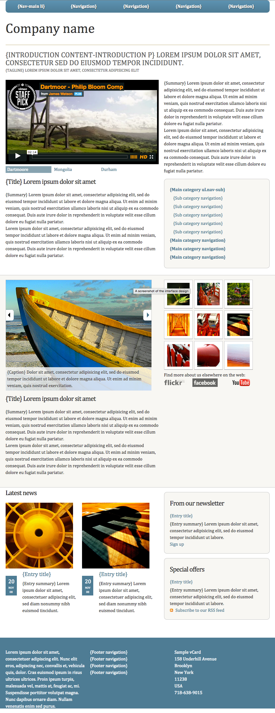

# Foundations Session 9

## Homework
Continue on your final projects.



## Tooling

petershift:

```
"scripts": {
    "start": "browser-sync start --browser \"chrome\" --server \"app\" --files \"app\"",
    "sassy": "node-sass --watch sass --output \"app\\css\" --source-map true 2>&1 | build-error-notifier",
    "boom!": "concurrently \"npm run start\" \"npm run sassy\" "
  },
```

```
$ cd <session9>
$ npm install
```

Create a Git repo.

Create and upload a branch to Github.

`$ npm run boom!`


### Review

1) Video Switcher - JavaScript with Active class

```
const iFrame = document.querySelector('iframe')
const videoLinks = document.querySelectorAll('.content-video a')
const videoLinksArray = [...videoLinks]
videoLinksArray.forEach( videoLink => videoLink.addEventListener('click', selectVideo ))

function selectVideo(){
    removeActiveClass()
    this.classList.add('active')
    const videoToPlay = this.getAttribute('href')
    iFrame.setAttribute('src', videoToPlay)
    event.preventDefault()
}

function removeActiveClass(){
    videoLinksArray.forEach( videoLink => videoLink.classList.remove('active'))
}
```

Note that the removeActiveClass funtion seems broken.

2) JavaScript and css for nav-sub 

```css
.nav-sub {
    padding: 10px 20px;
    background-color: $lt-yellow;
    border: 1px solid $dk-yellow;
    @media (min-width: $break-med){
        width: 40%;
        float: right;
        border-radius: $radius;
        margin: 0;
        float: none;
        width: auto;
    }
    ul {
        display:none;
    }
    li:first-child ul {
        display:block;
    }
    > li > a { 
        font-weight:bold; 
    }
    ul li {
        padding-left:12px;
    }
    .active {display: block !important}
}
```

Note the `>` [selector](https://www.w3schools.com/cssref/css_selectors.asp). Also see [Combinators](https://developer.mozilla.org/en-US/docs/Learn/CSS/Introduction_to_CSS/Simple_selectors)

[DOM Traversal](https://www.w3schools.com/jsref/dom_obj_document.asp)
nextElementSibling, nextSibling, previousSibling, childNodes, firstChild, etc.

```
const subnavLinks = document.querySelectorAll('.nav-sub > li > a')
const subnavLinksArray = [...subnavLinks]
subnavLinksArray.forEach( subnavLink => subnavLink.addEventListener('click', openAccordion))
subnavLinksArray[0].nextElementSibling.classList.add('active')

function openAccordion(){
    removeActiveClass()
    this.nextElementSibling.classList.toggle('active')
    event.preventDefault()
}

function removeActiveClass(){
    subnavLinksArray.forEach( subnavLink => subnavLink.nextElementSibling.classList.remove('active'))
}
```

Note the lack of animation.

===== END REVIEW =====

### removeActiveClass

This appears twice and the video switcher is broken. Let's unify this

```
function openAccordion(){
    removeActiveClass('accordion')
    this.nextElementSibling.classList.toggle('active')
    event.preventDefault()
}

```

```
function selectVideo(){
    removeActiveClass('video')
    const videoToPlay = this.getAttribute('href')
    iFrame.setAttribute('src', videoToPlay)
    this.classList.add('active')
    event.preventDefault()
}
```

```
function removeActiveClass(locale){
    if (locale === 'accordion') {
        subnavLinksArray.forEach( subnavLink => subnavLink.nextElementSibling.classList.remove('active'))
    } else if (locale === 'video') {
        videoLinksArray.forEach( videoLink => videoLink.classList.remove('active'))
    }
}
```


### Subnav

Fix animation with

```
    ul {
        // display: none;
        max-height: 0;
        overflow: hidden;
        transition: all .3s;
```

and

```
    .active { 
        max-height: 500px;
    }
```

#### Sticky Nav

```
nav {
    position: fixed;
    width: 100%;
```

Test. 

Followed by cosmetic adjustments:

```
header {
    max-width: $max-width;
    margin: 0 auto;
    h1 {
        font-size: 3rem;
        padding-top: 50px;
    }
```

Design note: its common to include a box shadow on elements that float atop.


### Image Carousel 

Do a DOM review of this section of the page.

In _carousel.scss:

```css
.secondary aside {
    ul {
        display: flex;
        flex-wrap: wrap;
        align-content: space-around;
        li {
            margin: 6px;
        }
        li img {
            width: 80px;
            padding: 10px;
            background-color: #fff;
            border: 1px solid $dk-yellow;
            transition: all 0.2s linear;
            &:hover {
                transform: scale(1.1);
                box-shadow: 1px 1px 1px rgba(0,0,0,0.4);
            }
        }
    }
}
```

Note transition:

```css
li img {
    ...
    transition: all 0.2s linear;
    &:hover {
        transform: scale(1.1);
        box-shadow: 1px 1px 1px rgba(0,0,0,0.4);
    }
```

Content Slider - examine image

```css
figure {
    position: relative;
    figcaption {
        padding: 6px;
        background: rgba(255,255,255,0.7);
        position: absolute;
        bottom: 0;
    }
}   
```

### Image Carousel - JavaScript

Change the # links to point to high res images (first three only in this sample):

```
<ul class="image-tn">
  <li>
    <a href="img/bamboo.jpg"></a>
  </li>
  <li>
    <a href="img/bridge.jpg"></a>
  </li>
  <li>
    <a href="img/pagoda.jpg"></a>
  </li>
```

Change the title text as well.

Old school JavaScript:

```js
$('.image-tn a').on('click tap', function(){
    var imgsrc = $(this).attr('href');
    var titleText = $(this).find('img').attr('title');
    $('figure > img').attr('src', imgsrc);
    $('figcaption').html(titleText);
    return false;
});
```

```
const carouselLinks = document.querySelectorAll('.image-tn a')
const carouselLinksArray = [...carouselLinks]
const carousel = document.querySelector('figure img')

carouselLinksArray.forEach( carouselLink => carouselLink.addEventListener('click', runCarousel ))

function runCarousel(){
    const imageHref = this.getAttribute('href')
    carousel.setAttribute('src', imageHref)
    event.preventDefault()
}
```

Set the text in the carousel.

Find the appropriate traversal `const titleText = this.firstChild.title`:

```
function runCarousel(){
    const imageHref = this.getAttribute('href')
    const titleText = this.firstChild.title
    carousel.setAttribute('src', imageHref)
    event.preventDefault()
}
```

Create a pointer to the figcaption in order to manipulate its content:

```
const carouselPara = document.querySelector('figcaption')
```

Set the innerHTML `carouselPara.innerHTML = titleText` of the paragraph:

```
function runCarousel(){
    const imageHref = this.getAttribute('href')
    const titleText = this.firstChild.title
    carouselPara.innerHTML = titleText
    console.log(carouselPara)
    carousel.setAttribute('src', imageHref)
    event.preventDefault()
}
```

Final script:

```
const carouselLinks = document.querySelectorAll('.image-tn a')
const carouselLinksArray = [...carouselLinks]
const carousel = document.querySelector('figure > img')
const carouselPara = document.querySelector('figcaption')
carouselLinksArray.forEach( carouselLink => carouselLink.addEventListener('click', runCarousel ))

function runCarousel(){
    const imageHref = this.getAttribute('href')
    const titleText = this.firstChild.title
    carouselPara.innerHTML = titleText
    carousel.setAttribute('src', imageHref)
    event.preventDefault()
}
```

Note the separation of thumbnails and figure in small screen view.

```
.secondary article {
    display: flex;
    flex-direction: column;
    figure {
        order: 2;
    }
}
```

Correct wide screen view:

```
.secondary article {
    display: flex;
    flex-direction: column;
    figure {
        order: 2;
        @media(min-width: $break-med){
            order: 0;
        }
    }
}
```


### The Panels (the third and final section)

Review the design. Let's try floats and absolute/relative positioning.

In _panels.scss:

```css
.hentry {
  position: relative;
  float: left;
  width: 50%;
}
```

Add padding (note the use of box-sizing):

```
.hentry {
    position: relative;
    float: left;
    width: 50%;
    box-sizing: border-box;
    padding: 1rem;
}
```

The little date area

The HTML5 [time tag](https://www.w3schools.com/tags/tag_time.asp) and datetime attribute

```css
.hentry {
    ...
    .published {
        position: absolute;
        top: 250px;
        left: 1rem;
        display: block;
        width: 30px;
        padding: 5px 10px;
        background-color: $link;
        font-size: 10px;
        text-align: center;
        text-transform: uppercase;
        color: #fff;
    }
    .day {
        font-size: 26px;
    }
    h4 {
        margin: 0 0 10px 60px;
        font-size: 20px;
    }
    p {
        margin-left: 60px;
    }
}
```

Parent container .hentries is used here.

Redo the entire design - mobile first:

```css
.hentries {
    display: flex;
    justify-content: space-between;
    .hentry {
        display: flex;
        flex-direction: column;
        width: 48%;

        .published {
            font-size: 0.875rem
        }
        h4 {
            font-size: 20px;
            margin-top:  1rem;
            margin-bottom: 0;
        }
        p {
            order: 2;
        }
    }
}
```

Final _panels.scss:

```
.hentries {
    display: flex;
    abbr {
        text-decoration: none;
    }
    .hentry {
        float: left;
        box-sizing: border-box;
        width: 50%;
        padding: 0 8px;
        .published {
            text-align: center;
            float: left;
            width: 24%;
            box-sizing: border-box;
            display: block;
            padding: 2px 6px;
            background-color: $link;
            font-size: 10px;
            text-align: center;
            text-transform: uppercase;
            color: #fff;
        }
        .day {
            font-size: 32px;
        }
        h4 {
            font-size: 20px;
        }
        p {
            margin-top: 0;
            float: right;
            width: 70%;
            box-sizing: border-box;
        }
    }
}
```

Note RSS feed attribute selectors

```css
a[rel="alternate"] {
    padding-left: 20px;
    background: url(../img/a-rss.png) no-repeat 0 50%;
}
```

with svg:

```css
a[rel="alternate"] {
    padding-left: 20px;
    background: url(../img/feed-icon.svg) no-repeat 0 50%;
    background-size: contain;
}
```


## Notes

### Links Smooth Scrolling

`<li><a href="#two">Summary</a></li>`

`<div class="secondary" id="two">`

```
html {
  scroll-behavior: smooth;
}
```

https://www.sitepoint.com/smooth-scrolling-vanilla-javascript/

```
initSmoothScrolling();

function initSmoothScrolling() {
  if (isCssSmoothSCrollSupported()) {
    return;
  }

  var duration = 400;

  var pageUrl = location.hash ?
    stripHash(location.href) :
    location.href;

  delegatedLinkHijacking();
  //directLinkHijacking();

  function delegatedLinkHijacking() {
    document.body.addEventListener('click', onClick, false);

    function onClick(e) {
      if (!isInPageLink(e.target))
        return;

      e.stopPropagation();
      e.preventDefault();

      jump(e.target.hash, {
        duration: duration,
        callback: function() {
          setFocus(e.target.hash);
        }
      });
    }
  }

  function directLinkHijacking() {
    [].slice.call(document.querySelectorAll('a'))
      .filter(isInPageLink)
      .forEach(function(a) {
        a.addEventListener('click', onClick, false);
      });

    function onClick(e) {
      e.stopPropagation();
      e.preventDefault();

      jump(e.target.hash, {
        duration: duration,
      });
    }

  }

  function isInPageLink(n) {
    return n.tagName.toLowerCase() === 'a' &&
      n.hash.length > 0 &&
      stripHash(n.href) === pageUrl;
  }

  function stripHash(url) {
    return url.slice(0, url.lastIndexOf('#'));
  }

  function isCssSmoothSCrollSupported() {
    return 'scrollBehavior' in document.documentElement.style;
  }

  // Adapted from:
  // https://www.nczonline.net/blog/2013/01/15/fixing-skip-to-content-links/
  function setFocus(hash) {
    var element = document.getElementById(hash.substring(1));

    if (element) {
      if (!/^(?:a|select|input|button|textarea)$/i.test(element.tagName)) {
        element.tabIndex = -1;
      }

      element.focus();
    }
  }

}

function jump(target, options) {
  var
    start = window.pageYOffset,
    opt = {
      duration: options.duration,
      offset: options.offset || 0,
      callback: options.callback,
      easing: options.easing || easeInOutQuad
    },
    distance = typeof target === 'string' ?
    opt.offset + document.querySelector(target).getBoundingClientRect().top :
    target,
    duration = typeof opt.duration === 'function' ?
    opt.duration(distance) :
    opt.duration,
    timeStart, timeElapsed;

  requestAnimationFrame(function(time) {
    timeStart = time;
    loop(time);
  });

  function loop(time) {
    timeElapsed = time - timeStart;

    window.scrollTo(0, opt.easing(timeElapsed, start, distance, duration));

    if (timeElapsed < duration)
      requestAnimationFrame(loop)
    else
      end();
  }

  function end() {
    window.scrollTo(0, start + distance);

    if (typeof opt.callback === 'function')
      opt.callback();
  }

  // Robert Penner's easeInOutQuad - http://robertpenner.com/easing/
  function easeInOutQuad(t, b, c, d) {
    t /= d / 2
    if (t < 1) return c / 2 * t * t + b
    t--
    return -c / 2 * (t * (t - 2) - 1) + b
  }

}
```


### Follow Along

```
const triggers = document.querySelectorAll('a')
const highlight = document.createElement('span')
highlight.classList.add('highlight')
document.body.append(highlight)
function highlightlink(){
  const linkCoords = this.getBoundingClientRect();
  const coords = {
    width: linkCoords.width,
    height: linkCoords.height,
    left: linkCoords.left + window.scrollX,
    top: linkCoords.top + window.scrollY
  }
  highlight.style.width = `${coords.width}px`
  highlight.style.height = `${coords.height}px`
  highlight.style.transform = `translate(${coords.left}px, ${coords.top}px)`
}
triggers.forEach( (a) => a.addEventListener('mouseenter', highlightlink))
```


